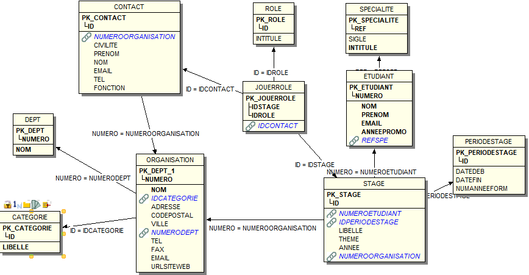
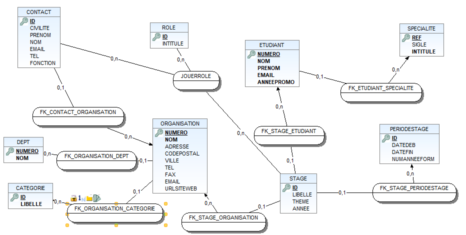
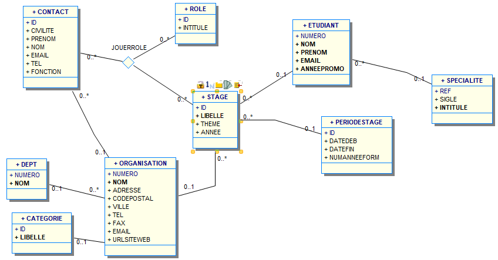
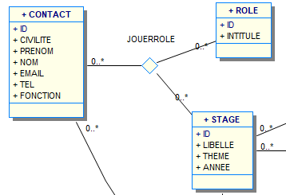

# Documentation WinDesign

## 1. Créer le modele relationnelle à partir du sql

* En cliquant sur "Database" → Reversing Engineering, sélectionner le "Reverse Script" sur Oracle, puis sélectionner le fichier de création des tables.
* Ensuite il suffit de suivre les instructions en les validant (attention à l'affichage où il faut refuser de cacher les informations)
* Voici le modèle relationnelle du script sql :
  

## 2. Créer le modele conceptuelle à partir du modele relationnelle
* En cliquant sur "Modèle", sélectionner "Générer Modèle Conceptuelle"
* Voici le résultat :
  

## 3. Créer le diagramme de classe à partir du modele conceptuelle
* La dernière étape est la création du Diagramme de classe, pour se faire il faut cliquer sur "Modèle" et "Générer Diagramme de classe (UML)"
* Voici le résultat du diagrame de classe :
  

### Attention le diagramme de classe possède une erreur !!

Un ID de stage et un ID de rôle permet la création d'un contact. 

La multiplicité de contact n'est pas bon dans le cas ci-dessus.

La multiplicité de contact doit être à 1 pour faire comprendre que c'est le rôle et le stage qui créer un contact.