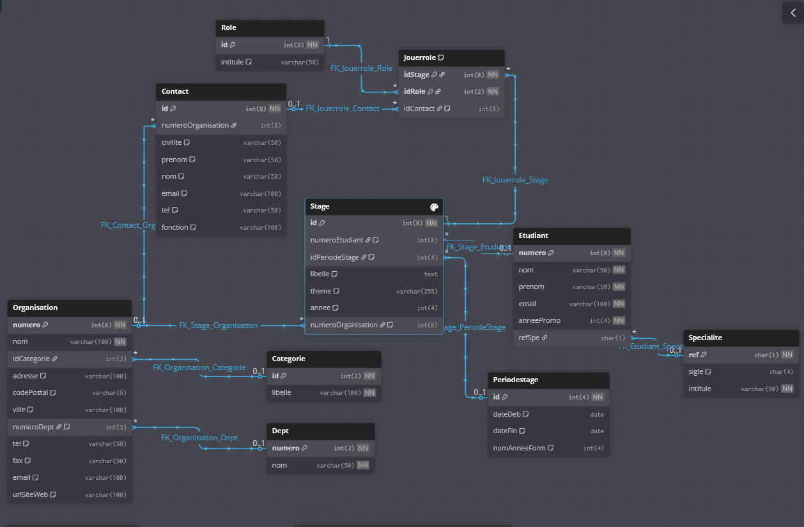

URL pour y accéder : https://dbdiagram.io/d/travail-68c435b8841b2935a64a5c29
# Rétro conception ULM
Allez sur l'URL suivante : https://dbdiagram.io

Ensuite prenez le code SQL contenue [ici]("./etude/stages_createTable_v1.sql")
puis sur l'application web cliquer sur `import` puis sur `from Mysql`.

Coller le code que vous venez de copier (pour séléctionner tout le contenue d'un fichier il suffit de faire `ctrl+a`), enfin cliquer sur `submit`.

Vous obtiendrez votre diagram UML.

Tips : Pour partager votre diagram UML il vous suffit de cliquer sur share puis vous pouvez copier le liens et le donner a d'autre personne afin qu'elle puisse le consulter.

Voici un exemple de ce que l'on peux avoir après l'import d'un script SQL:



```sql
Table "Specialite" {
  "ref" char(1) [pk, not null]
  "sigle" char(4) [default: NULL]
  "intitule" varchar(60) [not null]
}

Table "Etudiant" {
  "numero" int(8) [pk, not null]
  "nom" varchar(50) [not null]
  "prenom" varchar(50) [not null]
  "email" varchar(100) [not null]
  "anneePromo" int(4) [not null]
  "refSpe" char(1)
}

Table "Categorie" {
  "id" int(3) [pk, not null]
  "libelle" varchar(100) [not null]
}

Table "Dept" {
  "numero" int(3) [pk, not null]
  "nom" varchar(50) [not null]
}

Table "Organisation" {
  "numero" int(8) [pk, not null]
  "nom" varchar(100) [not null]
  "idCategorie" int(3)
  "adresse" varchar(100) [default: NULL]
  "codePostal" varchar(6) [default: NULL]
  "ville" varchar(100) [default: NULL]
  "numeroDept" int(3) [default: NULL]
  "tel" varchar(50) [default: NULL]
  "fax" varchar(50) [default: NULL]
  "email" varchar(100) [default: NULL]
  "urlSiteWeb" varchar(100) [default: NULL]
}

Table "Contact" {
  "id" int(8) [pk, not null]
  "numeroOrganisation" int(8)
  "civilite" varchar(50) [default: NULL]
  "prenom" varchar(50) [default: NULL]
  "nom" varchar(50) [default: NULL]
  "email" varchar(100) [default: NULL]
  "tel" varchar(50) [default: NULL]
  "fonction" varchar(100) [default: NULL]
}

Table "Periodestage" {
  "id" int(4) [pk, not null]
  "dateDeb" date [default: NULL]
  "dateFin" date [default: NULL]
  "numAnneeForm" int(4) [default: NULL]
}

Table "Role" {
  "id" int(2) [pk, not null]
  "intitule" varchar(50) [default: NULL]
}

Table "Stage" {
  "id" int(8) [pk, not null]
  "numeroEtudiant" int(8) [default: NULL]
  "idPeriodeStage" int(4) [default: NULL]
  "libelle" text [default: NULL]
  "theme" varchar(255) [default: NULL]
  "annee" int(4) [default: NULL]
  "numeroOrganisation" int(8) [default: NULL]
}

Table "Jouerrole" {
  "idStage" int(8) [not null]
  "idRole" int(2) [not null]
  "idContact" int(8) [default: NULL]

  Indexes {
    (idStage, idRole) [pk, name: "PK_Jouerrole"]
  }
}

Ref "FK_Etudiant_Specialite":"Specialite"."ref" < "Etudiant"."refSpe"

Ref "FK_Organisation_Categorie":"Categorie"."id" < "Organisation"."idCategorie"

Ref "FK_Organisation_Dept":"Dept"."numero" < "Organisation"."numeroDept"

Ref "FK_Contact_Organisation":"Organisation"."numero" < "Contact"."numeroOrganisation"

Ref "FK_Stage_Organisation":"Organisation"."numero" < "Stage"."numeroOrganisation"

Ref "FK_Stage_Etudiant":"Etudiant"."numero" < "Stage"."numeroEtudiant"

Ref "FK_Stage_PeriodeStage":"Periodestage"."id" < "Stage"."idPeriodeStage"

Ref "FK_Jouerrole_Stage":"Stage"."id" < "Jouerrole"."idStage"

Ref "FK_Jouerrole_Role":"Role"."id" < "Jouerrole"."idRole"

Ref "FK_Jouerrole_Contact":"Contact"."id" < "Jouerrole"."idContact"
```
